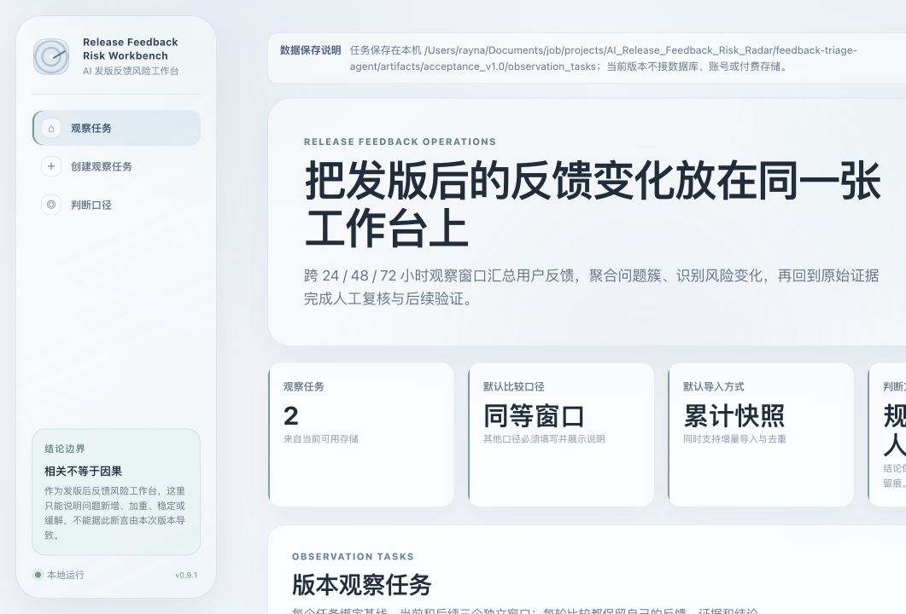
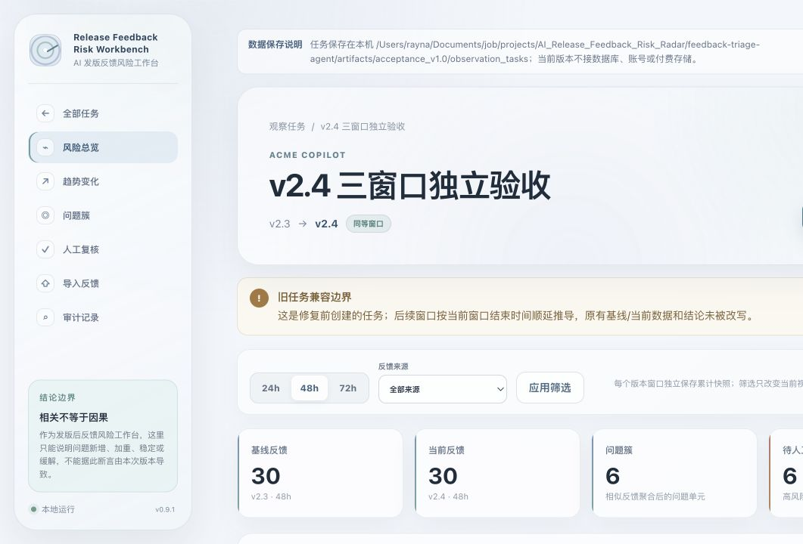
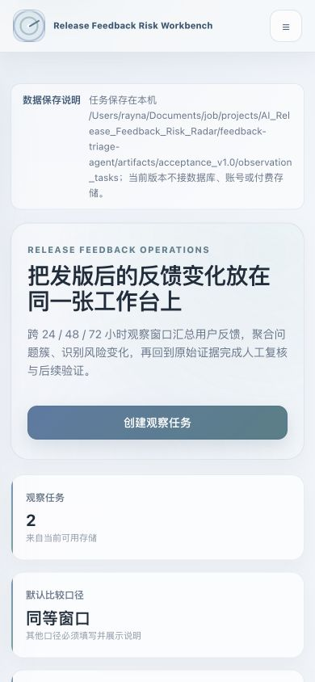

# Release Feedback Risk Workbench

## AI 发版反馈风险工作台

这是一个用于产品发版后的反馈风险工作台：在 24 / 48 / 72 小时等多个时间窗口汇总真实用户反馈，识别问题簇与风险变化，支持人工复核，并把每个结论回到原始证据和审计记录。陌生用户可以从“创建观察任务 → 导入基线与当前反馈 → 比较窗口变化 → 复核问题 → 下一窗口验证”的完整工作流理解它的用途。

`feedback-triage-agent` 继续承担字段标准化、分类、优先级、badcase、规则 fallback、QA、运行日志和评测等分析与审计能力；这些能力与新版工作台共享数据和状态，不是两个 Demo 的跳转或页面拼接。

当前交付状态：v1.0 已完成本地独立验收并上线线上 Demo：[feedback-triage-agent.vercel.app](https://feedback-triage-agent.vercel.app/)。仓库名、GitHub 地址和 Vercel 项目绑定保持不变。

## 界面预览

README 中的原始验收截图继续保存在 `artifacts/acceptance_v1.0/screenshots/`，不覆盖、不替换。本次视觉收口后的截图将单独放在 `artifacts/v1.0_visual_closure/screenshots/`，用于区分“原始验收材料”和“当前界面预览”。







## 产品解决什么问题

产品发布新版本后，团队通常能看到很多零散反馈，却很难回答：

- 哪些问题是发版后新增、加重、稳定或缓解？
- 多条说法不同的反馈是否在描述同一个问题？
- 风险结论能否回到具体用户原话和数据口径？
- 哪些判断需要人工确认，谁负责处理，下一窗口是否真的改善？

工作台提供的最小闭环是：

```text
创建版本观察任务
→ 定义基线与当前窗口
→ 导入反馈
→ 校验并标准化
→ 聚合问题簇
→ 比较数量与占比
→ 回看原始证据
→ 人工确认 / 驳回 / 合并 / 拆分
→ 记录负责人、动作和结果
→ 下一观察窗口继续验证
```

系统只能说明某个问题在发版后新增或加重。版本变化和反馈变化同时发生不等于存在因果关系；版本改动摘要只用于辅助复核，不能替代证据。

## 适用范围与边界

适合：

- 中小型 AI / SaaS 团队的产品经理、产品运营和用户反馈负责人。
- 发版后的 24 / 48 / 72 小时观察，以及后续重复观察。
- 应用商店评论、客服工单、社区反馈和访谈摘录等 CSV 数据。
- 需要保留原始证据、人工判断和处理过程的轻量工作流。

不适合：

- 证明某个版本改动一定导致某个问题。
- 替代埋点、崩溃平台、实验平台或正式工单系统。
- 直接给出未经人工确认的生产事故结论。
- 多租户、权限、合规归档或长期在线存储场景。
- 依赖 RAG、向量数据库、爬虫或 Jira / Slack 真实写入的流程。

## 核心产品逻辑

### 1. 版本与比较口径

每个观察任务绑定产品、基线版本、当前版本和两个时间窗口。

- 默认使用同等长度窗口，减少因观察时长不同造成的数量偏差。
- 如果业务上必须使用其他口径，创建任务时必须填写说明，任务列表和工作台都会持续标注“非同等口径”。
- 24 / 48 / 72 小时代表发版后的累计观察时长，不是三组预置演示结果。

### 2. 累计快照与增量导入

导入同时支持两种方式：

- `cumulative`：默认方式。上传某个版本截至当前观察窗口的完整反馈快照。
- `incremental`：只上传上次导入后新增的反馈。

两种方式都会按反馈标识去重，并保留导入方式、来源、文件名、有效数、重复数和异常数。累计快照优先用于版本前后比较；增量模式用于数据源只能导出新增记录的情况。

### 3. 从单条反馈到问题簇

工作台不再把“一条反馈”直接当成“一张问题卡”。分析引擎先对反馈做确定性标准化和分类，再把描述同类问题的多条反馈聚合成问题簇。

每个问题簇同时保留：

- 基线与当前版本的反馈数量。
- 该问题占各自窗口全部反馈的比例。
- 数量和占比的变化。
- 新增、加重、稳定、缓解或证据不足状态。
- 风险等级、判断依据、置信度和证据缺口。
- 组成问题簇的原始反馈、来源、反馈 ID、窗口和可选评分。

反馈级优先级和问题簇级风险是两层不同判断，不会用一个标签替代另一层含义。

### 4. 人工复核与处理

高风险、低置信度、多意图、规则与模型冲突或证据不足的问题进入人工复核。用户可以：

- 确认或驳回系统结论。
- 保持观察。
- 合并重复问题簇。
- 拆分被错误聚合的成员反馈。
- 更新风险等级、负责人、处理状态、下一步动作和处理结果。

人工操作不会覆盖原始反馈和系统初始判断，而是作为新的审计记录追加。负责人摘要只收录有原始证据且经过人工确认的问题。

### 5. 下一观察窗口

同一任务可以继续导入 48 小时、72 小时或后续窗口。工作台根据新的真实反馈重新计算问题数量与占比，并展示问题是缓解、持续还是恶化。人工填写“已处理”不等于数据已经改善，下一窗口仍需用反馈验证。

## 审计如何嵌入工作流

审计不是单独的装饰页面，而是问题簇卡片和运行过程的一部分：

- 导入记录说明输入是否完整、哪些行被接受、去重或拒绝。
- 问题簇展示结论对应的原始反馈证据。
- 风险依据和证据缺口与风险等级一起展示。
- 低置信度、规则冲突和 fallback 会进入复核或运行留痕。
- 人工确认、驳回、合并、拆分和字段更新按时间追加。
- 前后窗口的数量、占比、状态和当前筛选口径可以互相核对。
- 页面指标来自任务底层数据，不使用硬编码演示通过数或业务结果。

## 输入数据

### 发版风险工作台

新版观察任务导入允许 `rating` 缺失，不会为了满足格式伪造评分。建议 CSV 至少提供：

- `id`：反馈在来源内的稳定标识。
- `source`：反馈来源；也可以在导入表单中明确填写来源。
- `review_text`：用户原始反馈正文。
- `rating`：可选，存在时必须是 1–5。

常见列名可以通过现有标准化规则映射，例如 `reviewId`、`content`、`score`、`platform`。无法识别正文、正文为空或字段非法时会记录为输入问题，不会猜测语义值。

### 旧 CLI / 七步接口

为保持已有调用兼容，旧 `run` 和结构化 Web 运行入口仍要求五个字段：

- `id`
- `source`
- `app_name`
- `review_text`
- `rating`

如果第三方 CSV 列名不同，可以通过旧 `ask` 入口明确要求标准化。旧流程仍按以下七步执行：

```text
load_feedback
→ validate_schema
→ classify_feedback
→ detect_badcases
→ generate_issue_cards
→ qa_check
→ export_report
```

旧流程继续输出 `triage_results.csv`、`issue_cards.md`、`qa_report.md`、`run_log.md`、`weekly_summary.md` 和人工复核文件。它保留为兼容和单批次诊断能力，不再是合并后产品的主页面。

## 本地运行

项目要求 Python 3.9+。

```bash
cd feedback-triage-agent
python -m venv .venv
source .venv/bin/activate
python -m pip install -e ".[dev]"
python -m feedback_triage_agent.web_app
```

然后访问：

```text
http://127.0.0.1:8000
```

本地观察任务默认写入 `data/observation_tasks/`。这是免费的 JSON / 文件持久化：服务重启后任务仍在，但没有账号隔离、并发数据库能力或云端备份。可以用 `FEEDBACK_RISK_TASKS_DIR` 指定其他可写目录。

## 旧 CLI 命令

运行内置样例：

```bash
python -m feedback_triage_agent.cli demo
```

运行五字段 CSV：

```bash
python -m feedback_triage_agent.cli run \
  --input data/sample_feedback.csv \
  --output data/output \
  --no-llm
```

使用旧自然语言入口并先标准化外部 CSV：

```bash
python -m feedback_triage_agent.cli ask \
  "分析 /path/to/reviews.csv，转换为符合格式，输出到 data/output_ask，只用规则"
```

查看已有输出或生成静态报告：

```bash
python -m feedback_triage_agent.cli inspect --output data/output
python -m feedback_triage_agent.cli report --output data/output
```

## LLM 与 fallback

发版风险工作台的核心比较、聚合、审计和人工状态不依赖付费模型。旧 Ask 解析和单条反馈初稿仍可选用 DeepSeek；没有 API key、Web 开关未启用或调用失败时回退到本地规则。

不要把 API key 写入代码或提交到 Git。需要时在本地环境设置：

```bash
export DEEPSEEK_API_KEY="your_deepseek_api_key"
export FEEDBACK_TRIAGE_WEB_LLM_ENABLED=true
```

可选配置见 `.env.example`。公开 Demo 不应上传真实用户隐私、商业秘密或生产数据。

## 存储与部署

当前版本不接数据库、登录、权限、多租户或付费存储。

- 本地：观察任务保存在 `data/observation_tasks/`，旧单批次运行保存在 `data/web_runs/`。
- Vercel：观察任务默认写入 `/tmp/feedback-risk-tasks/`，旧运行写入 `/tmp/feedback-triage-runs/`。
- Vercel 的 `/tmp` 是临时存储，平台重启或实例回收后任务可能丢失，因此线上 Demo 只适合展示流程。

可以指定可写目录：

```bash
export FEEDBACK_RISK_TASKS_DIR="/path/to/observation_tasks"
export FEEDBACK_TRIAGE_WEB_RUNS_DIR="/path/to/web_runs"
```

Vercel 入口为 `app.py`。部署命令：

```bash
vercel --prod
```

## 测试与代表性 badcase 回归

运行自动化测试：

```bash
python -m pytest
```

运行本地规则评测：

```bash
python -m feedback_triage_agent.cli evaluate \
  --input data/evaluation_feedback.csv \
  --output data/evaluation_output
```

`data/evaluation_feedback.csv` 是人工维护的小样本 golden set，用于发现分类、优先级和人工复核规则是否退化；`data/adversarial_feedback.csv` 用于观察否定语义、多意图和关键词误伤等 badcase。它们不代表生产准确率，也不能用来声称真实业务效果。

## 项目链接

- [Online Demo](https://feedback-triage-agent.vercel.app/)
- [GitHub](https://github.com/Rayna-RRR/feedback-triage-agent)
